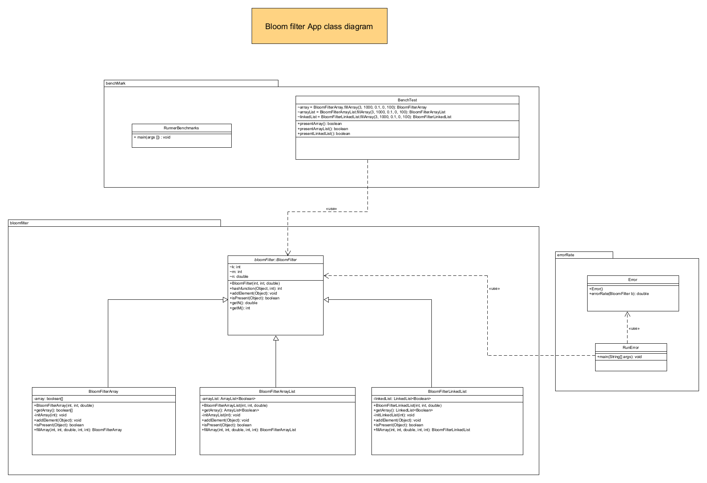
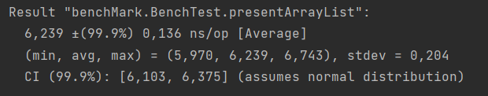
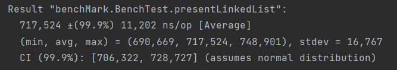
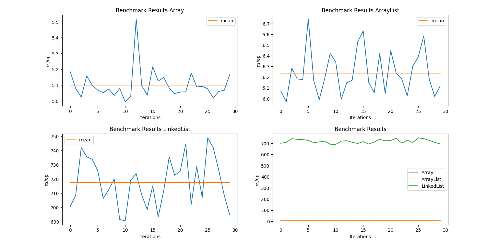
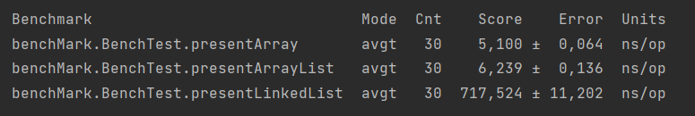
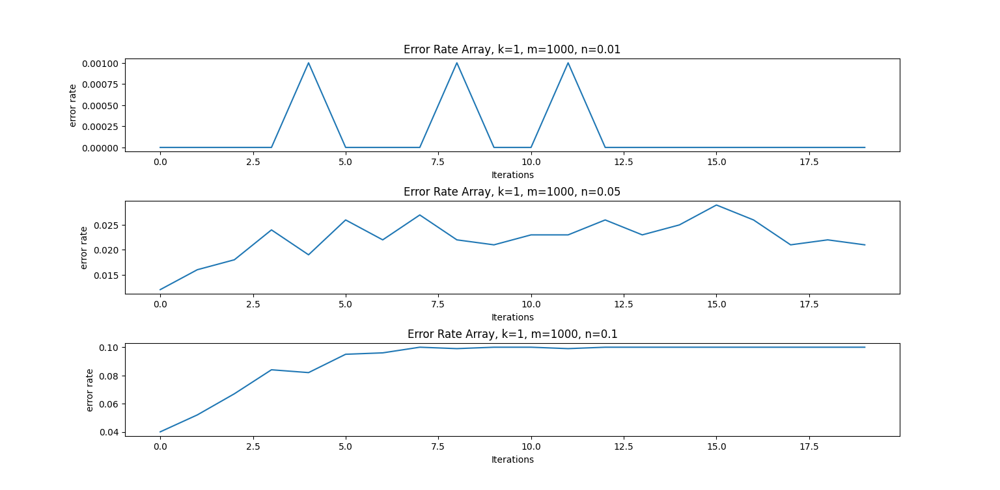
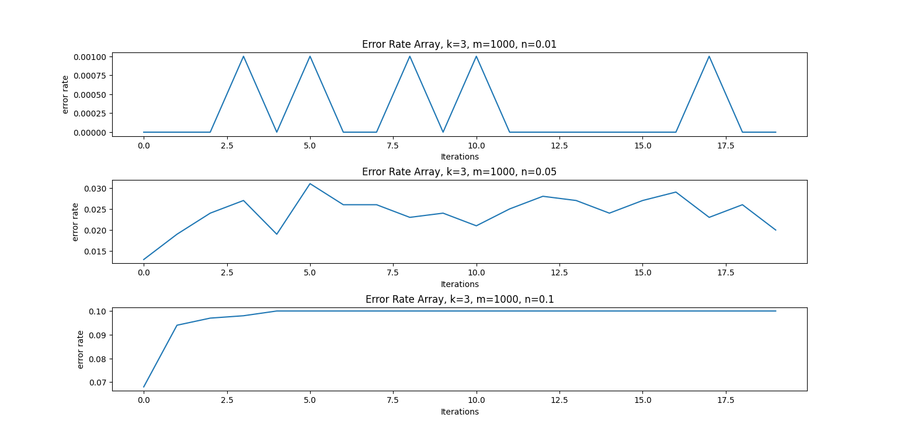
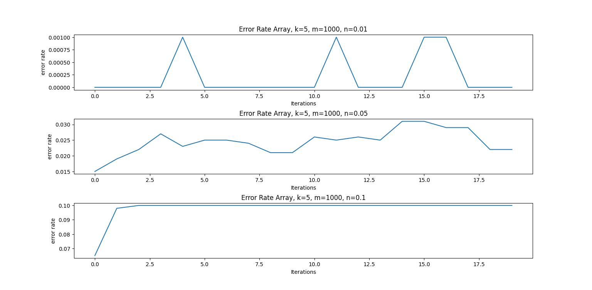

# BloomFilter

## Getting started

This java application uses Maven.

I added the following dependencies in my POM.xml to be able to create benchmarks.

```java
<dependency>
    <groupId>org.openjdk.jmh</groupId>
    <artifactId>jmh-core</artifactId>
    <version>1.35</version>
</dependency>
<dependency>
    <groupId>org.openjdk.jmh</groupId>
    <artifactId>jmh-generator-annprocess</artifactId>
    <version>1.35</version>
</dependency>

```

A bloom filter is a probabilistic structure. A bloom filter allows us to be absolutly certain that :

- an element is not included in the filter (can't be false negative).
- an element is included in the filter with a certain probability (false positive).

A bloom filter has :
- ```k``` hash functions
- a length ```m```.
- a percentage ```n``` of m elements to insert into the filter.

For example, consider this bloom filter object creation.
```java 
BloomFilter bloomfilter = new BloomFilter(5, 1000, 0.1);
```
Where 
- ```k``` = 5
- ```m``` = 1000
- ```n``` = 0.1 (in other words, 100 elements to insert into the filter)

## Class Diagram

This is an overview of my project through a class diagram.



## Benchmarking

One of the main purpose of this project was to benchmark the bloom filter and compare execution performance of an element searching function. (isPresent() function).

For this, I used  JMH (Java - Microbenchmark - Harness).

My sources : 
- https://www.loicmathieu.fr/wordpress/informatique/introduction-a-jmh-java-microbenchmark-harness/
-   https://www.baeldung.com/java-microbenchmark-harness
- https://andybui01.github.io/bloom-filter/
- https://fr.wikipedia.org/wiki/Filtre_de_Bloom
- https://belief-driven-design.com/java-benchmarks-with-jmh-dc58837c0b3/

### <u>How to run benchmarks with JMH</u>  

1) Create a class that will contains the main function for benchmarking.
        
e.g :
```java
public class RunnerBenchmarks {

    public static void main(String[] args) throws Exception{
    }

}

``` 

2) In the main function 
- Create a new ```Options``` object that will be used to configure your benchmarks.
- Declare a ```Runner``` object that will run your benchmarks.  

```java
Options opt = new OptionsBuilder().forks(5).build();
        new Runner(opt).run();
```

When the main function will be executed, functions in other classes with ```@Benchmark``` annotation will be executed.

Measurements outputs will be printed in the console.

### <u>Results</u>

Benchmark has been runned for each data structure on a presence element test :
1. Simple array
2. ArrayList
3. LinkedList

```k``` do not change. For these tests, k equals to 3.

### <u>Array Results</u>


The average execution time here is very small. It is thanks to the direct access of elements stored at a specific array index. 

### <u>ArrayList Results</u>



It is the same as arrays, the average execution time here is also very small. It is thanks to the direct access of elements stored elements stored at a specific arraylist index. It is a little bit more slower than arrays.

6,239 ns/op > 5,1 ns/op.

### <u>LinkedList Results</u>



LinkedList are slow compared to arrays or arraylists. To access elements stored at specific indexes, it is necessary to browse the list by following the cell links by cell until the one sought.

We arrive here at a time execution average of 717,724 ns/op. which is around 140,7 time slower than a simple array.

### <u>General Results</u>





## Error Rate

You can see a general view of the error rate package in the class diagram.

The function errorRate of the class Error takes as parameter a BloomFilter object and computes the error rate with integers.

The error rate is determined by the number of false positive divided by the number of elements in the filter. 

To calculate the error rate, we must :
- insert ```n``` elements in the filter
- test the presence of the same amont of elements (```n```) with different values than the elements inserted in the filter.

The following error rate graphics have been plotted with python. Plots have been measured for the simple data structure : Array.

There are for this error rate computation, 20 iterations, so 20 points.

Here is the main function that runs 20 iterations on the error rate.
```java
public static void main(String[] args) {
        Error error = new Error();
        BloomFilterArray array = new BloomFilterArray(5, 1000, 0.1);
        for (int i = 0; i < 20; i++) {
            System.out.println(error.errorRate(array));
        }
    }
```

### <u>Error Rate Graphics</u>

Tests for k = 1, 

n equals to : 
- 0.01 
- 0.05 
- 0.1.



Tests for k = 3, 

n equals to : 
- 0.01 
- 0.05 
- 0.1.



Tests for k = 5, 

n equals to : 
- 0.01 
- 0.05 
- 0.1.




Theses graphics above have commonalities :

- The more ```m``` is big, the more the error rate will be close to zero with ```n``` little.
- The more ```k``` is big, the more the error rate will be high with ```n``` big.


The error rate will not be greater than ```n```. It will be lower or equal than the error rate.
